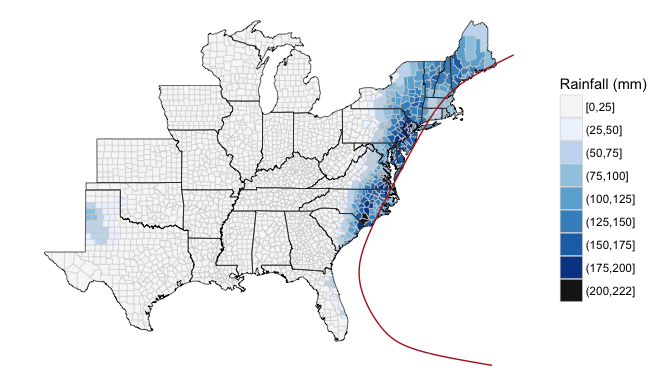
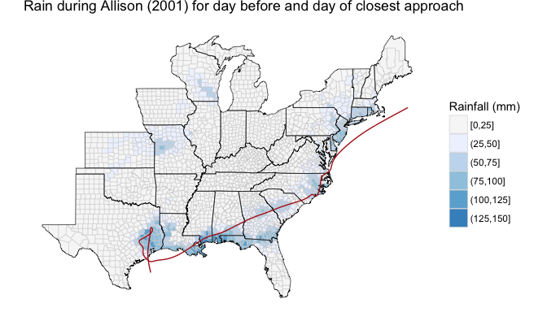
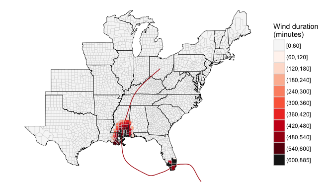
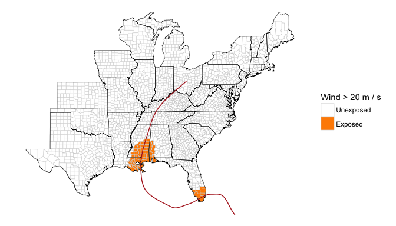
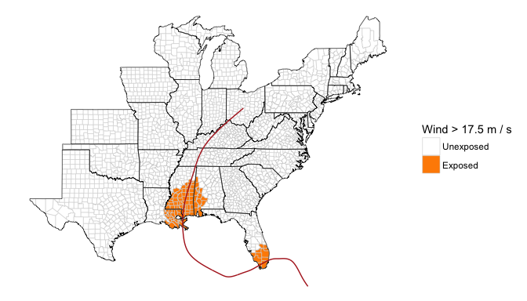
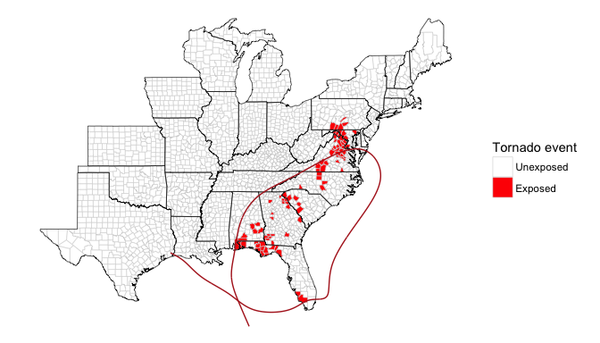

<!-- README.md is generated from README.Rmd. Please edit that file -->
Package overview
----------------

This package allows you to explore and map data on county-level exposures to Atlantic-basin tropical storms between 1988 and 2015 for a number of storm hazards (e.g., wind, rain, flood events, distance from the storm track) for counties in the eastern half of the United States. This package allows the user to map exposures by county for a selected storm or to identify all storms to which selected counties were exposed, based on user-specified thresholds (for example, the package allows the user to identify all storms that brought wind of 34 knots or higher to Miami-Dade County in Florida).

If you use this package and the data in the associated data package (`hurricaneexposuredata`) for research, please cite both packages. In particular, be sure to include the version of the packages that you used, as this will make your research project more reproducible, and the data will likely be updated as we get further years of data and find improved ways to measure tropical storm exposure. The two packages can be cited as:

-   Anderson B, Yan M, Ferreri J, Crosson W, Al-Hamdan M, Schumacher A and Eddelbuettel D (2017). *hurricaneexposure: Explore and Map County-Level Hurricane Exposure in the United States*. R package version 0.0.1, &lt;URL: <http://CRAN.R-project.org/package=hurricaneexposure>&gt;.

-   Anderson B, Schumacher A, Crosson W, Al-Hamdan M, Yan M, Ferreri J, Chen Z, Quiring S and Guikema S (2017). *hurricaneexposuredata: Data Characterizing Exposure to Hurricanes in United States Counties*. R package version 0.0.1, &lt;URL: <https://github.com/geanders/hurricaneexposuredata>&gt;.

To generate BibTex entries for the packages, you can use the `citation` function in R.

Required set-up to use this package
-----------------------------------

This package depends on data in a data package (`hurricaneexposuredata`) that is available through a `drat` repository on GitHub. To use the `hurricaneexposure` package, you will need to install `hurricaneexposuredata` on your computer. You can do that by adding the `drat` repository to your repositories; once you do this, you can install the `hurricaneexposuredata` using the `install.packages` function (and later update it using the `update.packages` function):

``` r
library(drat)
addRepo("geanders")
install.packages("hurricaneexposuredata")
```

The `hurricaneexposuredata` data package includes data that characterizes county-level exposure to tropical storms in counties in the eastern half of the United States between 1988 and 2015 (for some hazards, exposure data is only included for a subset of these years). Tropical storms that did not pass within at least 250 km of at least one US county were excluded from these datasets. The following datasets are included with the `hurricaneexposuredata` data package:

-   `county_centers`: Location of United States county centers of population
-   `hurr_tracks`: Storm tracks for Atlantic-basin storms, 1988-2015
-   `closest_dist`: Closest distances between counties and a storm track, for Atlantic-basin storms, 1988-2015
-   `rain`: Rainfall for US counties during Atlantic basin tropical storms, 1988-2011; daily rainfall is given from five days before to three days after the storm's closest approach to the county
-   `storm_winds`: Modeled county wind speeds for Atlantic-basin storms, 1988-2015
-   `storm_events`: Listings from the NOAA Storm Events database that occurred near in time and location to tropical storms, 1988-2015. This database changed the types of events it reported in 1996, which should be considered when using the data.
-   `ext_tracks_wind`: Estimated county wind speeds for Atlantic-basin storms, 1988-2015, based on the wind radii listed in the Extended Best Tracks dataset

Once you've installed and loaded `hurricaneexposuredata`, you can load the included data using the `data` function. For example:

``` r
library(hurricaneexposuredata)
data("hurr_tracks")
head(hurr_tracks)
#>       storm_id         date latitude longitude wind
#> 1 Alberto-1988 198808051800     32.0     -77.5   20
#> 2 Alberto-1988 198808060000     32.8     -76.2   20
#> 3 Alberto-1988 198808060600     34.0     -75.2   20
#> 4 Alberto-1988 198808061200     35.2     -74.6   25
#> 5 Alberto-1988 198808061800     37.0     -73.5   25
#> 6 Alberto-1988 198808070000     38.7     -72.4   25
```

For each dataset included in `hurricaneexposuredata`, you can see the helpfiles for the data for more information about the data included in each (e.g., `?hurr_tracks` to read documentation on the hurricane tracks data shown above). This data documentation includes both explanations of how the dataset was created, definitions of the variables included in each dataset, and the sources of data included.

The following table shows the storms covered by the `hurricaneexposuredata` data package, as well as which hazard metrics are available for each year. All storms passed within 250 km of at least one U.S. county.

<table>
<colgroup>
<col width="8%" />
<col width="38%" />
<col width="13%" />
<col width="8%" />
<col width="8%" />
<col width="10%" />
<col width="11%" />
</colgroup>
<thead>
<tr class="header">
<th align="center">Year</th>
<th align="left">Storms</th>
<th align="center">Distance</th>
<th align="center">Wind</th>
<th align="center">Rain</th>
<th align="center">Flood</th>
<th align="center">Tornado</th>
</tr>
</thead>
<tbody>
<tr class="odd">
<td align="center">1988</td>
<td align="left">Alberto, Beryl, Chris, Florence, Gilbert, Keith</td>
<td align="center">x</td>
<td align="center">x</td>
<td align="center">x</td>
<td align="center"></td>
<td align="center">x</td>
</tr>
<tr class="even">
<td align="center">1989</td>
<td align="left">Allison, Chantal, Hugo, Jerry</td>
<td align="center">x</td>
<td align="center">x</td>
<td align="center">x</td>
<td align="center"></td>
<td align="center">x</td>
</tr>
<tr class="odd">
<td align="center">1990</td>
<td align="left">Bertha, Marco</td>
<td align="center">x</td>
<td align="center">x</td>
<td align="center">x</td>
<td align="center"></td>
<td align="center">x</td>
</tr>
<tr class="even">
<td align="center">1991</td>
<td align="left">Ana, Bob, Fabian, Notnamed</td>
<td align="center">x</td>
<td align="center">x</td>
<td align="center">x</td>
<td align="center"></td>
<td align="center">x</td>
</tr>
<tr class="odd">
<td align="center">1992</td>
<td align="left">Andrew, Danielle, Earl</td>
<td align="center">x</td>
<td align="center">x</td>
<td align="center">x</td>
<td align="center"></td>
<td align="center">x</td>
</tr>
<tr class="even">
<td align="center">1993</td>
<td align="left">Arlene, Emily</td>
<td align="center">x</td>
<td align="center">x</td>
<td align="center">x</td>
<td align="center"></td>
<td align="center">x</td>
</tr>
<tr class="odd">
<td align="center">1994</td>
<td align="left">Alberto, Beryl, Gordon</td>
<td align="center">x</td>
<td align="center">x</td>
<td align="center">x</td>
<td align="center"></td>
<td align="center">x</td>
</tr>
<tr class="even">
<td align="center">1995</td>
<td align="left">Allison, Dean, Erin, Gabrielle, Jerry, Opal</td>
<td align="center">x</td>
<td align="center">x</td>
<td align="center">x</td>
<td align="center"></td>
<td align="center">x</td>
</tr>
<tr class="odd">
<td align="center">1996</td>
<td align="left">Arthur, Bertha, Edouard, Fran, Josephine</td>
<td align="center">x</td>
<td align="center">x</td>
<td align="center">x</td>
<td align="center">x</td>
<td align="center">x</td>
</tr>
<tr class="even">
<td align="center">1997</td>
<td align="left">Subtrop, Ana, Danny</td>
<td align="center">x</td>
<td align="center">x</td>
<td align="center">x</td>
<td align="center">x</td>
<td align="center">x</td>
</tr>
<tr class="odd">
<td align="center">1998</td>
<td align="left">Bonnie, Charley, Earl, Frances, Georges, Hermine, Mitch</td>
<td align="center">x</td>
<td align="center">x</td>
<td align="center">x</td>
<td align="center">x</td>
<td align="center">x</td>
</tr>
<tr class="even">
<td align="center">1999</td>
<td align="left">Bret, Dennis, Floyd, Harvey, Irene</td>
<td align="center">x</td>
<td align="center">x</td>
<td align="center">x</td>
<td align="center">x</td>
<td align="center">x</td>
</tr>
<tr class="odd">
<td align="center">2000</td>
<td align="left">Beryl, Gordon, Helene, Leslie</td>
<td align="center">x</td>
<td align="center">x</td>
<td align="center">x</td>
<td align="center">x</td>
<td align="center">x</td>
</tr>
<tr class="even">
<td align="center">2001</td>
<td align="left">Allison, Barry, Gabrielle, Michelle</td>
<td align="center">x</td>
<td align="center">x</td>
<td align="center">x</td>
<td align="center">x</td>
<td align="center">x</td>
</tr>
<tr class="odd">
<td align="center">2002</td>
<td align="left">Arthur, Bertha, Cristobal, Edouard, Fay, Gustav, Hanna, Isidore, Kyle, Lili</td>
<td align="center">x</td>
<td align="center">x</td>
<td align="center">x</td>
<td align="center">x</td>
<td align="center">x</td>
</tr>
<tr class="even">
<td align="center">2003</td>
<td align="left">Bill, Claudette, Erika, Grace, Henri, Isabel</td>
<td align="center">x</td>
<td align="center">x</td>
<td align="center">x</td>
<td align="center">x</td>
<td align="center">x</td>
</tr>
<tr class="odd">
<td align="center">2004</td>
<td align="left">Alex, Bonnie, Charley, Frances, Gaston, Hermine, Ivan, Jeanne, Matthew</td>
<td align="center">x</td>
<td align="center">x</td>
<td align="center">x</td>
<td align="center">x</td>
<td align="center">x</td>
</tr>
<tr class="even">
<td align="center">2005</td>
<td align="left">Arlene, Cindy, Dennis, Emily, Katrina, Ophelia, Rita, Tammy, Wilma</td>
<td align="center">x</td>
<td align="center">x</td>
<td align="center">x</td>
<td align="center">x</td>
<td align="center">x</td>
</tr>
<tr class="odd">
<td align="center">2006</td>
<td align="left">Alberto, Beryl, Chris, Ernesto</td>
<td align="center">x</td>
<td align="center">x</td>
<td align="center">x</td>
<td align="center">x</td>
<td align="center">x</td>
</tr>
<tr class="even">
<td align="center">2007</td>
<td align="left">Andrea, Barry, Erin, Gabrielle, Humberto, Noel</td>
<td align="center">x</td>
<td align="center">x</td>
<td align="center">x</td>
<td align="center">x</td>
<td align="center">x</td>
</tr>
<tr class="odd">
<td align="center">2008</td>
<td align="left">Cristobal, Dolly, Edouard, Fay, Gustav, Hanna, Ike, Kyle, Paloma</td>
<td align="center">x</td>
<td align="center">x</td>
<td align="center">x</td>
<td align="center">x</td>
<td align="center">x</td>
</tr>
<tr class="even">
<td align="center">2009</td>
<td align="left">Claudette, Ida</td>
<td align="center">x</td>
<td align="center">x</td>
<td align="center">x</td>
<td align="center">x</td>
<td align="center">x</td>
</tr>
<tr class="odd">
<td align="center">2010</td>
<td align="left">Alex, Bonnie, Earl, Hermine, Nicole, Paula</td>
<td align="center">x</td>
<td align="center">x</td>
<td align="center">x</td>
<td align="center">x</td>
<td align="center">x</td>
</tr>
<tr class="even">
<td align="center">2011</td>
<td align="left">Bret, Don, Emily, Irene, Lee</td>
<td align="center">x</td>
<td align="center">x</td>
<td align="center">x</td>
<td align="center">x</td>
<td align="center">x</td>
</tr>
<tr class="odd">
<td align="center">2012</td>
<td align="left">Alberto, Beryl, Debby, Isaac, Sandy</td>
<td align="center">x</td>
<td align="center">x</td>
<td align="center"></td>
<td align="center">x</td>
<td align="center">x</td>
</tr>
<tr class="even">
<td align="center">2013</td>
<td align="left">Andrea, Dorian, Karen</td>
<td align="center">x</td>
<td align="center">x</td>
<td align="center"></td>
<td align="center">x</td>
<td align="center">x</td>
</tr>
<tr class="odd">
<td align="center">2014</td>
<td align="left">Arthur</td>
<td align="center">x</td>
<td align="center">x</td>
<td align="center"></td>
<td align="center">x</td>
<td align="center">x</td>
</tr>
<tr class="even">
<td align="center">2015</td>
<td align="left">Ana, Bill, Claudette</td>
<td align="center">x</td>
<td align="center">x</td>
<td align="center"></td>
<td align="center">x</td>
<td align="center">x</td>
</tr>
</tbody>
</table>

In functions throughout the `hurricaneexposure` package, storms are identified based on their name and year (e.g., Hurricane Floyd in 1999 is identified as "Floyd-1999"). Note that a few storms satisfied this criteria but were unnamed (e.g., "Notnamed" in 1991, "Subtrop" in 1997, etc.). These storms are identified in functions in the `hurricaneexposure` package based on the identifying name listed in the above table (e.g., "Notnamed-1991"), although for many applications you may want to consider excluding these unnamed storms from the full analysis.

Mapping hurricane exposure
--------------------------

The `hurricaneexposure` package has functions to interact with the data in the `hurricaneexposuredata` package. First, this package has functions that can be used to create some different maps of hurricane exposures based on distance to the storm track and rainfall.

### Plotting county-level continuous exposure

First, for several of the storm hazard measurements (currently rain, wind, and distance), you can use the `map_counties` function in `hurricaneexposure` to plot a map for a specific storm showing the continuous value of that metric for all eastern U.S. counties. For example, you can map county-level rain during Hurricane Floyd (1999) using the following call:

``` r
map_counties(storm = "Floyd-1999", metric = "rainfall")
```



By default, this map shows the cumulative rain in each county for two days before to one day after the date that the storm passed closest to the county (see the help file for the `closest_dist` dataset in `hurricaneexposuredata` to find out more about how this date was determined for each county-storm combination). The period used to calculate cumulative rainfall for the map can be customized using the `days_included` option in the `map_counties` function. The two following examples show the difference in rain maps for Tropical Storm Allison (2001) when using rain only from the day before and the day the storm was closest to each county (`days_included = -1:0`) versus from five days before to three days after the storm's closest approach (`days_included = -5:3`):

``` r
map_counties(storm = "Allison-2001", metric = "rainfall", days_included = -1:0) + 
        ggplot2::ggtitle("Rain during Allison (2001) for day before and day of closest approach")
```



``` r
map_counties(storm = "Allison-2001", metric = "rainfall", days_included = -5:3) + 
        ggplot2::ggtitle("Rain during Allison (2001) for five days before to three days\nafter the day of closest approach")
```


You can also use the `map_counties` function to plot the maximum wind during the storm for each county. For this, you use the argument `metric = "wind"`. For example, you can plot county-specific storm winds during Hurricane Katrina (2005) with the call:

``` r
map_counties(storm = "Katrina-2005", metric = "wind")
```


These county winds are determined based on a model of wind speeds from Best Tracks hurricane data. See the documentation for the `storm_winds` dataset (`?storm_winds`) to find out more about this data; further details on the wind model are available in the vignettes for the [`stormwindmodel` package](https://cran.r-project.org/web/packages/stormwindmodel/index.html).

\[Add details about how to map this from the wind radii estimates, instead\]

Finally, you can also use this function to plot the closest distance between the storm and each county. For this, you use the argument `metric = "distance"`. For example, the following call plots county-level distances from the track of Hurricane Sandy (2012):

``` r
map_counties(storm = "Sandy-2012", metric = "distance")
```



See the documentation for the `closest_dist` dataset (`?closest_dist`) for more details on how distances from the storm track were calculated for each county.

### Mapping county-level binary exposure

You can also map binary county-level exposures, where each county is classified as "exposed" based on whether it meets a threshold for one of the hazard-based metrics. These maps can be created for the metrics shown in the continuous exposure maps above (wind, rain, and distance from the storm track). In addition, binary classification maps can also be created based on storm event listings for flood events and tornado events from the NOAA Storm Events database.

For example, you can map a binary variable of distance-based exposure using `map_distance_exposure`, with "exposure" defined as the county being within the number of kilometers given in `dist_limit` of the storm track. For example, you can map the counties that were within 75 km of Hurricane Sandy's storm track with the call:

``` r
map_distance_exposure(storm = "Sandy-2012", dist_limit = 75)
```


Similarly, you can map a binary variable county exposure based on rain using `map_rain_exposure`. In the case of rain, you must define exposure thresholds for both rainfall and distance. This is because the rain data is observed data, so neglecting to limit "exposed" counties to those close to the storm track may pick up counties far from the storm that experienced a lot of rain over the same period. For example, you can use the following call to map rain exposure to Tropical Storm Allison (2001), where exposure is defined as a county where cumulative rainfall from fives days before to three days after the storm's closest approach was 175 mm or more and where the county was within 500 km of the storm's track:

``` r
map_rain_exposure(storm = "Allison-2001", rain_limit = 175, dist_limit = 500,
                  days_included = -5:3)
```


As with the continuous maps of rain exposure, the number of days included to calculate cumulative rain can be adjusted with the `days_included` option in `map_rain_exposure` (see the help file for `map_rain_exposure` for more details).

You can use the `map_wind_exposure` function to map counties exposed to a certain level of wind during a storm. For example, to identify all counties exposed to sustained winds of 20 m / s or higher during Hurricane Katrina, you can run:

``` r
map_wind_exposure(storm = "Katrina-2005", wind_limit = 20)
```


If you would like to base a wind threshold on knots rather than m / s, you can use the `convert_wind_speed` function from the `weathermetrics` package to do that. For example, to map counties in which winds were 34 knots or higher during the storm, you can run:

``` r
library(weathermetrics)
map_wind_exposure(storm = "Katrina-2005", 
                  wind_limit = convert_wind_speed(34, "knots", "mps"))
```


Finally, you can map which counties were exposed to specific types of events, as listed in the NOAA Storm Events Database, using the `map_event_exposure` function. For example, you can map counties for which a flood event was listed for Hurricane Floyd (1999) with the call:

``` r
map_event_exposure(storm = "Floyd-1999", event_type = "flood")
```



Similarly, you can map which counties were exposed to tornado events during Hurricane Ivan (2004) with:

``` r
map_event_exposure(storm = "Ivan-2004", event_type = "tornado")
```



When using this function, note that the types of events reported in the NOAA Storm Events Database changed in 1996, so for many event types there will be no listings before 1996. Tornado listings do extend earlier, but flood listings do not. Further, when using this data, the user should be aware of and take into account the limitations of the database, especially for comparing storms across years. Reporting standards likely have changed over time; for example, it is possible that earlier years have more false negatives than more recent years.

Event listings from the NOAA Storm Events database were linked to storms based on the start date of the event being within a five-day window of the date the storm was closest to the county and the county being within 500 km of the county. The [`noaastormevents` package](https://github.com/zailchen/noaastormevents) was used to create this dataset. For more information on the data, see the help file for the `storm_events` dataset (`?storm_events`) or the vignette for the `noaastormevents` package.

### Plotting storm tracks

If you would like to add a storm's track to one of the maps of county-level exposure, you can do so using the `map_tracks` function. This function can be used either to map a storm track on a blank U.S. map or to add a track to an existing map, if it is a `ggplot` object (as are all maps generated in the previous section).

First, the `map_tracks` function can be used to create a map of the hurricane tracks for one or more storms. For example, to plot the tracks of Hurricane Floyd in 1999, you can run:

``` r
map_tracks(storms = "Floyd-1999")
```


There are some different options you can use for the tracks' appearance. For example, if you wanted to plot the tracks of several storms, and plot each point when the track locations were measured (typically every six hours), use some transparency so you can see all the tracks, and show the tracks in blue, you can run:

``` r
map_tracks(storms = c("Andrew-1992", "Katrina-2005", "Rita-2005"),
           alpha = 0.5, plot_points = TRUE, color = "blue")
```



The `map_tracks` function is used in all the mapping functions described in the previous function to add the storm's track to the exposure map. However, if you would like to customize the appearance of the storm's track on the map, you can do so by plotting the exposure map without the storm track (`add_track = FALSE`) and then adding the track yourself with the `map_tracks` function. For example, to change the color of the storm track in a map of flood event exposure during Hurricane Floyd (1999) and to add points showing the available observations for the storm in the Best Tracks hurricane tracking data, you can run:

``` r
floyd_map <- map_event_exposure(storm = "Floyd-1999", event_type = "flood")
map_tracks(storms = "Floyd-1999", plot_object = floyd_map, plot_points = TRUE, 
           color = "darkgray")
```


Creating time series datasets of exposure
-----------------------------------------

The `hurricaneexposure` package also has several functions that can input a list of counties and output a list of all of the storms each county was exposed to over a certain period, based on one of the hazard metrics. These exposure listings include the storm dates, making them easy to integrate into time series datasets of health or other impact data.

For example, the `county_rain` function takes a list of county FIPS codes, bounds on the starting and ending years of the analysis, and thresholds to define rain-based exposure (cumulative rainfall and distance from the storm's track, as explained for the binary rain maps shown in an earlier section) and creates a list of all storms that met these thesholds for the counties. For example, to get a dataset of all the storms to which Orleans Parish (FIPS 22071), and Newport News, Virginia (FIPS 51700), were exposed between 1995 and 2005, where "exposed" means that the storm passed within 100 kilometers of the county center and the rainfall over a three-day window of the date of closest approach was 100 millimeters or more, you can run:

``` r
county_rain(counties = c("22071", "51700"), start_year = 1995, end_year = 2005,
            rain_limit = 100, dist_limit = 100, days_included = c(-1, 0, 1))
#>        storm_id  fips closest_date storm_dist tot_precip       local_time
#> 1:    Bill-2003 22071   2003-06-30   38.78412      141.1 2003-06-30 18:00
#> 2: Charley-2004 51700   2004-08-14   43.01152      136.2 2004-08-14 19:45
#> 3:   Cindy-2005 22071   2005-07-06   32.21758      113.2 2005-07-06 02:15
#> 4:   Floyd-1999 51700   1999-09-16   46.50729      207.5 1999-09-16 11:15
#> 5: Isidore-2002 22071   2002-09-26    6.37844      249.0 2002-09-26 05:45
#> 6: Katrina-2005 22071   2005-08-29   36.88933      196.2 2005-08-29 08:45
#> 7: Matthew-2004 22071   2004-10-10   71.76937      123.2 2004-10-10 11:00
#>    closest_time_utc
#> 1: 2003-06-30 23:00
#> 2: 2004-08-14 23:45
#> 3: 2005-07-06 07:15
#> 4: 1999-09-16 15:15
#> 5: 2002-09-26 10:45
#> 6: 2005-08-29 13:45
#> 7: 2004-10-10 16:00
```

This function draws on the same dataset (`rain`) from the `hurricaneexposuredata` package as the functions for mapping rain exposure shown above. For this and other exposures, see the table earlier in this vignette to see which years of data are available (for rain, data is currently available for storms through 2011).

In addition to giving the names and closest dates of each storm for each county (`closest_date`-- note, this is given based on local time for the county; see documentation for the [`countytimezones` package](https://cran.r-project.org/web/packages/countytimezones/index.html) to find out more about how local time was calculated from UTC for each county), this function also gives you the distance between the county and the storm's track at the time when the storm was closest to the county's population weighted center (`storm_dist`, in kilometers) and the total precipitation over the included days (`tot_precip`). The returned dataframe also gives the time of closest approach in both local time (`local_time`) and UTC (`closest_time_utc`), based on 15-minute intervals along the storm's track.

Similar functions are available in the package to create listings of county exposures to storms based on wind, distance to the storm track, and events listings from the NOAA Storm Events Database (flood and tornado events). For example, to get a listing of all storms between 1988 and 2015 for which Miami-Dade county (FIPS: ) has experienced sustained winds of 34 knots or more (17.5 m / s), you can run:

``` r
county_wind(counties = "12086", start_year = 1988, end_year = 2015, wind_limit = 17.5)
#>        storm_id  fips vmax_sust vmax_gust closest_time_utc storm_dist
#> 1   Andrew-1992 12086  52.09217  77.61733 1992-08-24 09:15   31.27000
#> 2    Mitch-1998 12086  20.59866  30.69200 1998-11-05 12:45  101.92795
#> 3   Harvey-1999 12086  21.99725  32.77590 1999-09-21 19:45   57.04194
#> 4    Irene-1999 12086  31.25318  46.56723 1999-10-15 23:15   43.55490
#> 5  Frances-2004 12086  20.65824  30.78078 2004-09-05 03:00  151.14075
#> 6   Jeanne-2004 12086  19.91442  29.67249 2004-09-26 02:45  162.22857
#> 7  Katrina-2005 12086  32.34194  48.18949 2005-08-25 23:45   10.78081
#> 8    Wilma-2005 12086  30.97431  46.15172 2005-10-24 12:45   92.31401
#> 9  Ernesto-2006 12086  18.02619  26.85902 2006-08-30 09:00   62.72792
#> 10     Fay-2008 12086  19.54363  29.12001 2008-08-19 11:45  123.92053
#>          local_time closest_date
#> 1  1992-08-24 05:15   1992-08-24
#> 2  1998-11-05 07:45   1998-11-05
#> 3  1999-09-21 15:45   1999-09-21
#> 4  1999-10-15 19:15   1999-10-15
#> 5  2004-09-04 23:00   2004-09-04
#> 6  2004-09-25 22:45   2004-09-25
#> 7  2005-08-25 19:45   2005-08-25
#> 8  2005-10-24 08:45   2005-10-24
#> 9  2006-08-30 05:00   2006-08-30
#> 10 2008-08-19 07:45   2008-08-19
```

The returned dataframe includes the estimated maximum values during the storm for sustained winds (`vmax_sust`) and gust winds (`vmax_gust`), both in m / s. It also includes some of the variables on the date and time of closest approach and the distance at the storm's closest approach.

The `county_distance` function can similarly be used to generate a listing of all storms that came within a certain distance of specified counties. For example, to get a list of all storms that came within 50 km of Orleans Parish (FIPS 22071) between 1988 and 2015, you can run:

``` r
county_distance(counties = "22071", start_year = 1988, end_year = 2015,
                dist_limit = 50)
#>          storm_id  fips closest_date storm_dist       local_time
#>  1:    Beryl-1988 22071   1988-08-09   6.545623 1988-08-09 05:30
#>  2: Florence-1988 22071   1988-09-10   9.341379 1988-09-10 02:30
#>  3:  Hermine-1998 22071   1998-09-20  48.178162 1998-09-20 06:45
#>  4:  Allison-2001 22071   2001-06-11  31.417675 2001-06-11 02:45
#>  5:   Bertha-2002 22071   2002-08-05  13.771178 2002-08-05 04:00
#>  6:  Isidore-2002 22071   2002-09-26   6.378440 2002-09-26 05:45
#>  7:     Bill-2003 22071   2003-06-30  38.784122 2003-06-30 18:00
#>  8:    Cindy-2005 22071   2005-07-06  32.217580 2005-07-06 02:15
#>  9:  Katrina-2005 22071   2005-08-29  36.889327 2005-08-29 08:45
#> 10:   Bonnie-2010 22071   2010-07-25  42.509405 2010-07-25 06:30
#>     closest_time_utc
#>  1: 1988-08-09 10:30
#>  2: 1988-09-10 07:30
#>  3: 1998-09-20 11:45
#>  4: 2001-06-11 07:45
#>  5: 2002-08-05 09:00
#>  6: 2002-09-26 10:45
#>  7: 2003-06-30 23:00
#>  8: 2005-07-06 07:15
#>  9: 2005-08-29 13:45
#> 10: 2010-07-25 11:30
```

Finally, you can use the `county_events` function to get a listing of all storms for which a county had a certain type of NOAA Storm Events listing. For example, to get a list of all storms for which Norfolk, Virginia, (FIPS: 51710) had a flood event listing, you can run:

``` r
county_events(counties = "51710", start_year = 1996, end_year = 2015, 
              event_type = "flood")
#>     fips       storm_id closest_time_utc storm_dist       local_time
#> 1  51710    Arthur-1996 1996-06-20 07:45  167.00098 1996-06-20 03:45
#> 2  51710   Subtrop-1997 1997-06-01 18:45  254.48542 1997-06-01 14:45
#> 3  51710    Dennis-1999 1999-09-05 04:15  191.43034 1999-09-05 00:15
#> 4  51710     Floyd-1999 1999-09-16 15:00   17.92387 1999-09-16 11:00
#> 5  51710     Irene-1999 1999-10-18 06:30  255.20296 1999-10-18 02:30
#> 6  51710      Kyle-2002 2002-10-12 08:15  140.32547 2002-10-12 04:15
#> 7  51710      Alex-2004 2004-08-03 19:30  202.94091 2004-08-03 15:30
#> 8  51710   Alberto-2006 2006-06-14 20:30   87.87372 2006-06-14 16:30
#> 9  51710   Ernesto-2006 2006-09-01 23:15   72.95581 2006-09-01 19:15
#> 10 51710     Irene-2011 2011-08-28 00:45   54.82468 2011-08-27 20:45
#> 11 51710     Sandy-2012 2012-10-29 23:15  315.58866 2012-10-29 19:15
#> 12 51710 Claudette-2015 2015-07-12 00:00  180.39928 2015-07-11 20:00
#>    closest_date
#> 1    1996-06-20
#> 2    1997-06-01
#> 3    1999-09-05
#> 4    1999-09-16
#> 5    1999-10-18
#> 6    2002-10-12
#> 7    2004-08-03
#> 8    2006-06-14
#> 9    2006-09-01
#> 10   2011-08-27
#> 11   2012-10-29
#> 12   2015-07-11
```

### Handling multi-county communities

Some datasets covering storm impacts might have communities composed of multiple counties rather than county-specific listings. To get a dataframe listing the relevant storms for multi-county communities, you can use the `multi_county_*` family of functions in a similar way to the `county_*` family of functions. For example, to get rain exposure listings in the case where one of the communities (New York, NY) is comprised of multiple counties, you can run:

``` r
communities <- data.frame(commun = c(rep("ny", 6), "no", "new"),
                         fips = c("36005", "36047", "36061",
                                  "36085", "36081", "36119",
                                  "22071", "51700"))
multi_county_rain(communities = communities, start_year = 1995, end_year = 2005,
                   rain_limit = 100, dist_limit = 100)
#> Source: local data frame [10 x 9]
#> Groups: commun [?]
#> 
#>    commun     storm_id closest_date       local_time closest_time_utc
#>    <fctr>        <chr>       <date>            <chr>            <chr>
#> 1     new Charley-2004   2004-08-14 2004-08-14 19:45 2004-08-14 23:45
#> 2     new   Danny-1997   1997-07-24 1997-07-24 15:00 1997-07-24 19:00
#> 3     new   Floyd-1999   1999-09-16 1999-09-16 11:15 1999-09-16 15:15
#> 4      no Allison-2001   2001-06-11 2001-06-11 02:45 2001-06-11 07:45
#> 5      no    Bill-2003   2003-06-30 2003-06-30 18:00 2003-06-30 23:00
#> 6      no   Cindy-2005   2005-07-06 2005-07-06 02:15 2005-07-06 07:15
#> 7      no Isidore-2002   2002-09-26 2002-09-26 05:45 2002-09-26 10:45
#> 8      no Katrina-2005   2005-08-29 2005-08-29 08:45 2005-08-29 13:45
#> 9      no Matthew-2004   2004-10-10 2004-10-10 11:00 2004-10-10 16:00
#> 10     ny   Floyd-1999   1999-09-16 1999-09-16 20:30 1999-09-17 00:30
#> # ... with 4 more variables: mean_dist <dbl>, mean_rain <dbl>,
#> #   max_rain <dbl>, min_dist <dbl>
```

The output from this function includes columns for the average closest distance for any of the counties in the community (`mean_dist`), the average precipitation for all the counties (`mean_precip`), the highest precipitation for any of the counties (`max_rain`), and the smallest distance between the storm track and any of the county population-weighted centers (`min_dist`).

Similar functions exist for wind exposure (`multi_county_wind`) and distance exposure (`multi_county_distance`).
