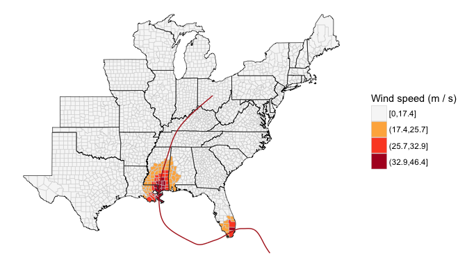
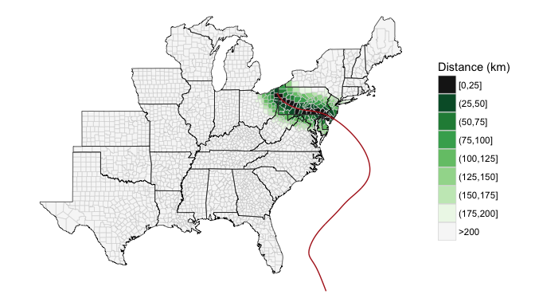
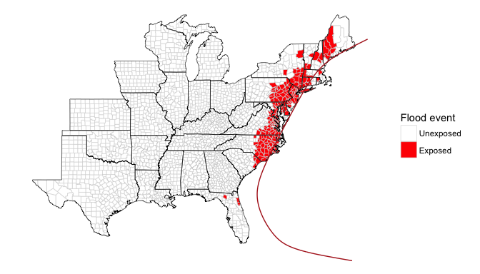
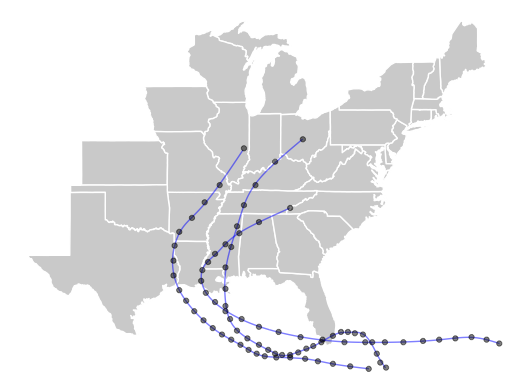
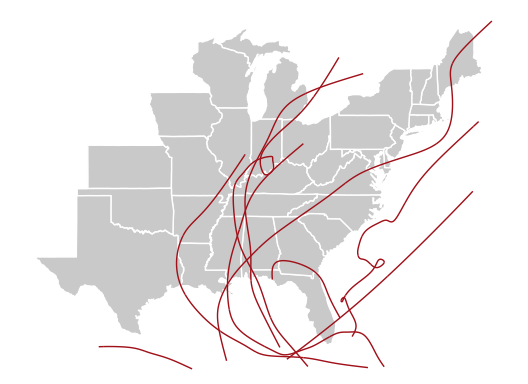

<!-- README.md is generated from README.Rmd. Please edit that file -->
Overview
--------

This package is meant to add users in creating datasets of tropical storm exposure at the county level for US counties. It covers counties in the eastern half of the United States and includes all Atlantic basin tropical storms between 1988 and 2015 (although data for some hazards are only available for some of those years). Tropical storm exposure datasets can be generated based on distance to storm tracks, rain, wind, or NOAA storm event listings (including tornado and flood events).

For non-R users, we are developing [a web application](https://zhimingguo.shinyapps.io/Hurricane_Map1/) to allow similar functionality. The exposure datasets generated by this web application can be downloaded as flat files and read into other software.

Loading the package
-------------------

The package currently exists in [a development version](https://github.com/geanders/hurricaneexposure) on GitHub, and all the associated data is in its own [development version package](https://github.com/geanders/hurricaneexposuredata), also on GitHub. You can use the following code to load both:

``` r
library(devtools)
install_github("geanders/hurricaneexposuredata")
install_github("geanders/hurricaneexposure", 
               build_vignettes = TRUE)
library(hurricaneexposuredata)
library(hurricaneexposure)
```

The following datasets are included with the `hurricaneexposuredata` package:

-   `closest_dist`: A dataframe that gives the distance and date-time for the closest approach of each tropical storm to the mean population center of each US county in states in the eastern half of the United States.
-   `county_centers`: A dataset containing the latitude and longitude of the center of population of every United State county, based on population as of the 2010 US Census.
-   `hurr_tracks`: A dataset containing the storm tracks for Atlantic basin tropical storms between 1988 and 2012, from the Extended Best Track Dataset for the Atlantic basin.
-   `rain`: A dataframe that gives the total rainfall in US counties for a one-week window centered at the date on which the tropical storm was closest to the county for Atlantic basin storms between 1988 and 2011.
-   `storm_winds`: A dataframe that gives modeled windspeeds in US counties for all eastern US counties for Atlantic basin tropical storms between 1988 and 2011.
-   `storm_events`: A dataframe that gives county-specific severe storm events listed in US counties temporally and spatially close to storm tracks for all eastern US counties for Atlantic basin tropical storms between 1988 and 2011.

Once you've loaded the `hurricaneexposuredata` package, you can load the included data using the `data` function. For example:

``` r
data("hurr_tracks")
head(hurr_tracks)
#>       storm_id         date latitude longitude wind
#> 1 Alberto-1988 198808051800     32.0     -77.5   20
#> 2 Alberto-1988 198808060000     32.8     -76.2   20
#> 3 Alberto-1988 198808060600     34.0     -75.2   20
#> 4 Alberto-1988 198808061200     35.2     -74.6   25
#> 5 Alberto-1988 198808061800     37.0     -73.5   25
#> 6 Alberto-1988 198808070000     38.7     -72.4   25
```

For each dataset, you can see the helpfiles for the data for more information by using the `?` call with the dataset name. For example, to access the documentation for the `hurr_tracks` dataset, you can run:

``` r
?hurr_tracks
```

Creating time series datasets of exposure
-----------------------------------------

There are several functions in this package that help to take the data on rainfall, wind, storm events, and storm tracks stored in the package and use them, in conjunction with user-specified thresholds, to create county-level time series of exposure that can be easily integrated into time series datasets of, for example, health data.

First, the `county_rain` function takes a list of county FIPS codes, bounds on the starting and ending years of the analysis, and thresholds for distance (storm path must come that close or closer to the county) and rainfall (total rainfall summed over the days you specify-- for example, `days_included = c(-1, 0, 1)` would use the total rainfall summed over the day before, day of, and day after the date when the storm was closest to the county). The function outputs a dataframe with all of the storms to which each of the counties was exposed.

For example, to get a dataset of all the storms to which Orleans Parish (FIPS 22071), and Newport News, Virginia (FIPS 51700), were exposed between 1995 and 2005, where "exposed" means that the storm passed within 100 kilometers of the county center and the rainfall over three days was 100 millimeters or more, you can run:

``` r
county_rain(counties = c("22071", "51700"),
            start_year = 1995, end_year = 2005,
            rain_limit = 100, dist_limit = 100,
            days_included = c(-1, 0, 1))
#>        storm_id  fips closest_date storm_dist tot_precip       local_time
#> 1:    Bill-2003 22071   2003-06-30   38.78412      141.1 2003-06-30 18:00
#> 2: Charley-2004 51700   2004-08-14   43.01152      136.2 2004-08-14 19:45
#> 3:   Cindy-2005 22071   2005-07-06   32.21758      113.2 2005-07-06 02:15
#> 4:   Floyd-1999 51700   1999-09-16   46.50729      207.5 1999-09-16 11:15
#> 5: Isidore-2002 22071   2002-09-26    6.37844      249.0 2002-09-26 05:45
#> 6: Katrina-2005 22071   2005-08-29   36.88933      196.2 2005-08-29 08:45
#> 7: Matthew-2004 22071   2004-10-10   71.76937      123.2 2004-10-10 11:00
#>    closest_time_utc
#> 1: 2003-06-30 23:00
#> 2: 2004-08-14 23:45
#> 3: 2005-07-06 07:15
#> 4: 1999-09-16 15:15
#> 5: 2002-09-26 10:45
#> 6: 2005-08-29 13:45
#> 7: 2004-10-10 16:00
```

In addition to giving you the names and closest dates of each storm for each county (`closest_date`-- note, this is given based on local time), this function also gives you the distance between the county and the storm's track at the time when the storm was closest to the county's population weighted center (`storm_dist`, in kilometers) and the total precipitation over the included days (`tot_precip`). The returned dataframe also includes columns with the local time (based on the counties timezone using the [`countytimezones`](https://cran.r-project.org/web/packages/countytimezones/index.html) R package) when the storm was closest to that county and the time in UTC (to aid in pairing with other weather data in UTC).

Some health data is aggregated at the multi-county, rather than county, level (e.g., data is available for New York City as a whole, rather than for each county in the city). To get a dataframe listing the relevant storms for multi-county communities, you can use the `multi_county_rain` function in a similar way, passing in a `communities` dataframe that lists all counties associated with each community:

``` r
communities <- data.frame(commun = c(rep("ny", 6), "no", "new"),
                         fips = c("36005", "36047", "36061",
                                  "36085", "36081", "36119",
                                  "22071", "51700"))
multi_county_rain(communities = communities,
                  start_year = 1995, end_year = 2005,
                  rain_limit = 100, dist_limit = 100,
                  days_included = c(-1, 0, 1))
#> Source: local data frame [8 x 9]
#> Groups: commun [?]
#> 
#>   commun     storm_id closest_date       local_time closest_time_utc
#>   <fctr>        <chr>       <date>            <chr>            <chr>
#> 1    new Charley-2004   2004-08-14 2004-08-14 19:45 2004-08-14 23:45
#> 2    new   Floyd-1999   1999-09-16 1999-09-16 11:15 1999-09-16 15:15
#> 3     no    Bill-2003   2003-06-30 2003-06-30 18:00 2003-06-30 23:00
#> 4     no   Cindy-2005   2005-07-06 2005-07-06 02:15 2005-07-06 07:15
#> 5     no Isidore-2002   2002-09-26 2002-09-26 05:45 2002-09-26 10:45
#> 6     no Katrina-2005   2005-08-29 2005-08-29 08:45 2005-08-29 13:45
#> 7     no Matthew-2004   2004-10-10 2004-10-10 11:00 2004-10-10 16:00
#> 8     ny   Floyd-1999   1999-09-16 1999-09-16 20:30 1999-09-17 00:30
#> # ... with 4 more variables: mean_dist <dbl>, mean_rain <dbl>,
#> #   max_rain <dbl>, min_dist <dbl>
```

This output includes columns for the average closest distance, averaged across all counties in the community (`mean_dist`), the average precipitation for all community counties (`mean_precip`), the highest precipitation for any community county (`max_rain`), and the smallest distance between the storm track and any of the county population-weighted centers (`min_dist`).

Similarly, `county_wind` and `multi_county_wind` functions can be used to generate exposure datasets based on wind exposure during tropical storms. For example, to determine all storms with sustained winds of 20 m / s or more for Orleans Parish (FIPS 22071), and Newport News, Virginia (FIPS 51700) between 1995 and 2005, you can run:

``` r
county_wind(counties = c("22071", "51700"),
            start_year = 1995, end_year = 2005,
            wind_limit = 20)
#>        storm_id  fips vmax_sust vmax_gust closest_time_utc storm_dist
#> 1   Bertha-1996 51700  28.04461  41.78648 1996-07-13 08:00   28.88430
#> 2    Danny-1997 22071  26.87702  40.04676 1997-07-18 10:00   74.31967
#> 3  Georges-1998 22071  24.63002  36.69874 1998-09-28 14:15  119.61533
#> 4    Floyd-1999 51700  25.03856  37.30745 1999-09-16 15:15   46.50729
#> 5  Allison-2001 22071  20.05557  29.88281 2001-06-11 07:45   31.41768
#> 6  Isidore-2002 22071  24.39045  36.34177 2002-09-26 10:45    6.37844
#> 7     Bill-2003 22071  21.79943  32.48115 2003-06-30 23:00   38.78412
#> 8   Isabel-2003 51700  26.76645  39.88201 2003-09-18 23:15  103.66800
#> 9    Cindy-2005 22071  21.14079  31.49978 2005-07-06 07:15   32.21758
#> 10 Katrina-2005 22071  40.26056  59.98823 2005-08-29 13:45   36.88933
#>          local_time closest_date
#> 1  1996-07-13 04:00   1996-07-13
#> 2  1997-07-18 05:00   1997-07-18
#> 3  1998-09-28 09:15   1998-09-28
#> 4  1999-09-16 11:15   1999-09-16
#> 5  2001-06-11 02:45   2001-06-11
#> 6  2002-09-26 05:45   2002-09-26
#> 7  2003-06-30 18:00   2003-06-30
#> 8  2003-09-18 19:15   2003-09-18
#> 9  2005-07-06 02:15   2005-07-06
#> 10 2005-08-29 08:45   2005-08-29
```

This function returns a dataframe that lists all the storms to which each county was exposed. The `vmax_sust` column gives the highest sustained wind modeled at the county's population mean center, while the `vmax_gust` gives the highest gust wind speed modeled there.

Creating and writing time series of exposure
--------------------------------------------

To create time series of hurricane exposure for all of the storms that meet the exposure definition for study communities, you can use the function `rain_exposure`. If you have counties for your study, you can run this with a vector of the county FIPS as the `locations` argument (specify the directory path to write the files with `out_dir`):

``` r
rain_exposure(locations = c("22071", "51700"),
              start_year = 1995, end_year = 2005,
              rain_limit = 100, dist_limit = 100,
              out_dir = "~/tmp/storms")
```

If you have multi-county communities, set `locations` instead to be a dataframe with community names (`commun` column) and FIPS codes (`fips` column):

``` r
communities <- data.frame(commun = c(rep("ny", 6), "no", "new"),
                          fips = c("36005", "36047", "36061",
                          "36085", "36081", "36119",
                          "22071", "51700"))
rain_exposure(locations = communities,
              start_year = 1995, end_year = 2005,
              rain_limit = 100, dist_limit = 100, out_dir = "~/tmp/storms")
```

Both functions will output one file of exposure per county or community into the directory that you specify using the `out_dir` argument.

Mapping hurricane exposure
--------------------------

This package allows you to create some different maps of hurricane exposures based on distance to the storm track and rainfall.

### Plotting county-level exposure

The `map_counties` function creates county choropleths of different storm exposure variables (right now, rainfall and distance from the storm tracks). For example, to plot rain exposure for Hurricane Floyd in 1999 (the ID for this storm is "Floyd-2012"):

``` r
map_counties(storm = "Floyd-1999", metric = "rainfall")
```



You can also use this function to plot the closest distance between the storm and each county. For this, you use the argument `metric`, which you can set equal to "rainfall", "wind", or "distance". For example, here is a map of wind-based exposure to Hurricane Katrina:

``` r
map_counties(storm = "Katrina-2005", metric = "wind")
```



Here is a map of distance-based exposure to the same storm:

``` r
map_counties(storm = "Katrina-2005", metric = "distance")
```


You can also create maps that show binary classification of exposure for each county--- whether that county exceeded a threshold used to define tropical storm exposure based on one of the hazards. For example, here is a map of all counties within 75 kilometers of the track of Tropical Storm Allison in 2001:

``` r
map_distance_exposure(storm = "Allison-2001", dist_limit = 75)
```


Similarly, here is a map of all counties with sustained winds of 20 m / s or higher during Katrina:

``` r
map_wind_exposure(storm = "Katrina-2005", wind_limit = 20)
```


Here is a map of all counties with 75 mm or more or rainfall over the day of, day before, and day after Hurricane Floyd, constrained to counties within 500 km of Floyd's track:

``` r
map_rain_exposure(storm = "Floyd-1999", rain_limit = 75,
                  dist_limit = 500, days_included = c(-1, 0, 1))
```


Here is a map of all counties with flood events listed in the NOAA Storm Events database near the time and location of Hurricane Floyd:

``` r
map_event_exposure(storm_id = "Floyd-1999", event_type = "flood")
```



Here are all the counties with tornado events listed for the same storm:

``` r
map_event_exposure(storm_id = "Floyd-1999", event_type = "tornado")
```


### Plotting storm tracks

The `map_tracks` function will map the hurricane tracks for one or more storms. For example, to plot the tracks of Hurricane Floyd in 1999 (the ID for this storm is "Floyd-2012"):

``` r
map_tracks(storms = "Floyd-1999")
```


There are some different options you can use for the tracks' appearance. For example, if you wanted to plot the tracks of several storms, plot a point each time the track locations were measured (typically every six hours), and use some transparency so you can see all the lines, you can use:

``` r
map_tracks(storms = c("Floyd-1999", "Sandy-2012",
                               "Katrina-2005"), 
           plot_points = TRUE, alpha = 0.5)
```



You can also add these tracks to an existing `ggplot`-created US map. You do this through the `plot_object` argument. For example, to add the storm track to the plot of distance exposure for Sandy or rain exposure for Floyd, you could run:

``` r
floyd_map <- map_counties(storm = "Floyd-1999", metric = "rainfall")
map_tracks(storms = "Floyd-1999", plot_object = floyd_map)
```


